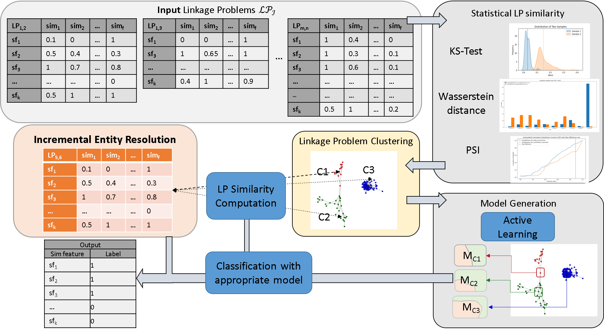

# Stop Relearning: Model Reuse via Feature Distribution Analysis for Incremental Entity Resolution

Entity resolution is essential for data integration, facilitating analytics and insights from 
complex systems. Multi-source and incremental entity resolution address the challenges of 
integrating diverse and dynamic data, which is common in real-world scenarios. 
A critical question is how to classify matches and non-matches among record pairs 
from new and existing data sources. Traditional threshold-based methods often yield lower quality 
than machine learning (ML) approaches, while incremental methods may lack stability depending on 
the order in which new data is integrated. 

Additionally, reusing training data and existing models for new data sources is unresolved for 
multi-source entity resolution. Even the approach of transfer learning does not consider the 
challenge of which source domain should be used to transfer model and training data information 
for a certain target domain. Naive strategies for training new models for each new linkage problem 
are inefficient.

This work addresses these challenges and focuses on managing existing models and the selection 
of suitable models for new data sources based on feature distributions. 
The results of our approach _StoRe_ demonstrate that our approach achieves comparable qualitative 
results and outperforms both a multi-source active learning method and a transfer learning approach regarding
efficiency.

## Worflow

## Datasets
| Name         | Source                                                                                                  | Description                                                                                                                                                                                                               |
|--------------|---------------------------------------------------------------------------------------------------------|---------------------------------------------------------------------------------------------------------------------------------------------------------------------------------------------------------------------------|
| dexter       | <a href='https://cloud.scadsai.uni-leipzig.de/index.php/s/RkoSzpdwkyYc87s'> Link </a>                   | camera data set comprises similarity graphs for 21023 camera product specifications from 23 data sources. The original data set was used in the Sigmod Programming Contest. We use only the records with their properties |
| wdc_almser   | <a href='http://data.dws.informatik.uni-mannheim.de/benchmarkmatchingtasks/almser_gen_data/'> Link </a> | provided data sets consisting of pairwise features from the Almser publication [1]                                                                                                                                        |
| music_almser | <a href='http://data.dws.informatik.uni-mannheim.de/benchmarkmatchingtasks/almser_gen_data/'> Link </a>                                                                      | provided data sets consisting of pairwise features from the Almser publication [1]                                                                                                                                        |

## Linkage Problem Generation

### Dexter
The generation is tailored for the dexter data set which is saved in the Gradoop csv format.
The following call generate similarity vectors for each data source pair and save the result as a pickle file consisting of 
a dictionary where the key is the data source pair and the value a dictionary of record pairs as key 
and feature vectors as value. 

`python record_linkage/linkage_generation_dexter.py -d datasets/(dataset_dir) -o data/linage_problems/(lp_path)`

### Almser datasets
To use the raw feature files provided from the Almser publication, we transform them to our format where each data source pair is saved in a dictionary 
with the similarity feature vector dictionary as value.

`python record_linkage/almser_linkage_reader.py -ff data/linkage_problems/music_almser/source_pairs
    -tp data/linkage_problems/selected_data_set/train_pairs_fv.csv 
    -gs data/linkage_problems/selected_data_set/test_pairs_fv.csv 
    -lo data/linkage_problems/selected_data_set`

## Run StoRe
`python store_pipeline/main_incremental.py --parameters`

### Parameters

| Name                              | Description                                                                                  | Options                                                                         |
|-----------------------------------|----------------------------------------------------------------------------------------------|---------------------------------------------------------------------------------|
| `--train_pairs` `-tp`          | Train pairs (input file containing training data).                                           | -                                                                               |
| `--test_pairs` `-gs`           | Test pairs (input file containing test data).                                                | -                                                                               |
| `--linkage_tasks_dir` `-l`     | Directory for linkage problems.                                                              | -                                                                               |
| `--statistical_test` `-s`      | Statistical test for comparing linkage problems.                                             | default: `ks_test`  `wasserstein_distance`, `calculate_psi`                  |
| `--ratio_sim_atomic_dis` `-rs` | Amount of similar feature distributions required for considering linkage problems as similar. | `0`                                                                             |
| `--comm_detect` `-cd`          | Community detection algorithm to use.                                                        | default:`leiden` `louvain`, `girvan_newman`, `label_propagation_clustering` |
| `--relevance_score` `-re`      | Relevance score for ordering the linkage problems of a cluster  (not used)                   | default: `betweenness_centrality`, `largest`, `pageRank`                        |
| `--active_learning` `-al`      | Active learning algorithm to use.                                                            | default: `almser`  `bootstrap`                                               |
| `--min_budget` `-mb`           | Minimum budget for each cluster.                                                             | default: `50`                                                                   |
| `--total_budget` `-tb`         | Total budget for the entire process.                                                         | default: `2000`                                                                 |
| `--budget_unsolved` `-ub`      | Budget for unsolved linkage problems that are not similar to any solved one.                 | default: `200`                                                                  |
| `--batch_size`  `-b`           | Batch size for processing.                                                                   | default: `5`                                                                    |

## References

[1] Anna Primpeli, Christian Bizer:
Graph-Boosted Active Learning for Multi-source Entity Resolution. ISWC 2021: 182-199